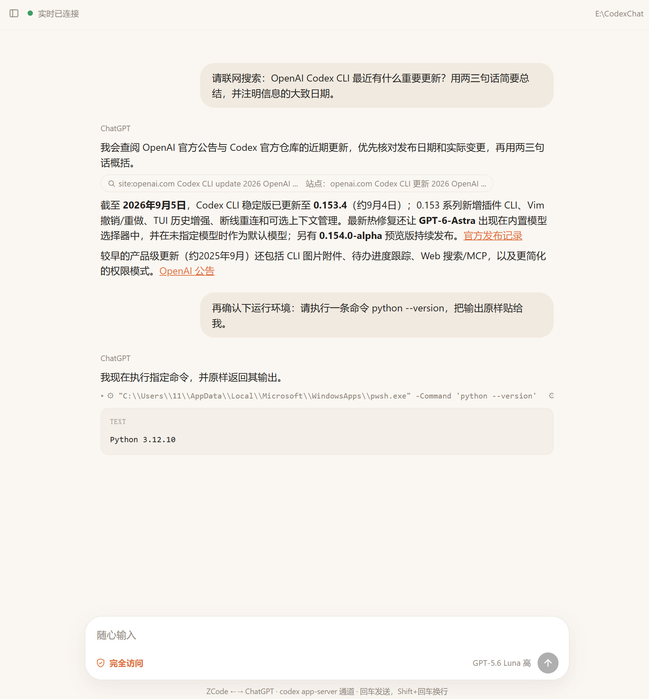

# CodexChat

A local, Codex-style web UI for chatting with ChatGPT in real time, built on the `codex app-server` protocol — same account and same thread store as the ChatGPT desktop app.

<p align="center"></p>

[English] | [简体中文](README.zh-CN.md)

## How it works

```
┌───────────────────┐ GET /  -  /api/events (SSE) ┌───────────────────┐ initialize / turn/start    ┌───────────────────┐
│      Browser      │ <-------------------------->│     server.py     │ <------------------------->│  codex app-server │
│     (static/)     │ POST /api/send - /api/stop  │     HTTP + SSE    │ JSON-RPC over stdio        │ (ChatGPT account) │
└───────────────────┘                             └───────────────────┘                            └───────────────────┘
```

- **Real-time**: replies stream token-by-token over Server-Sent Events, including 💭 reasoning, 🔎 web searches and ⚙ command executions, at the exact position they happen.
- **Same account**: reuses the ChatGPT login in `~/.codex/`; threads are written to Codex's own thread database (shared with the desktop app; the app only reads it at startup, so restart it to see new threads).
- **Zero dependencies**: `server.py` is pure Python standard library.
- **No CDN**: the UI and Markdown rendering are all local files — works offline.

## Requirements

- Windows (other platforms are untested but should work — just replace `start.bat` with `python server.py`)
- Python 3.10+
- A logged-in [Codex CLI](https://developers.openai.com/codex/cli/). `codex app-server` must be reachable at `~/codex-bin/codex.exe` or on PATH; override with the `CODEX_BIN` environment variable.

## Usage

- Run `start.bat` (or `python server.py`), then open `http://127.0.0.1:8765`.
- If the port is taken the server auto-increments; check the startup output or `server.log`.
- Chat history is stored in `state.json` and survives restarts; refreshing the page restores everything via the SSE snapshot.
- Stop with `stop.bat` (kills only this project's `server.py` process).

You can also use it as a companion tool for coding agents (ZCode / Claude Code / ...): the agent posts messages via `POST /api/send` while you watch the reply stream live in the browser. See the example skill in `skill/`.

## API

| Endpoint | Method | Description |
|---|---|---|
| `/api/state` | GET | Current thread + full message history + project/thread lists (JSON) |
| `/api/events` | GET (SSE) | Live event stream; a snapshot is pushed on connect |
| `/api/send` | POST `{text}` | Send a message (409 = previous turn still running) |
| `/api/last_text` | GET | Lightweight monitoring: last assistant text + tool-call counts only (for low-token agent polling) |
| `/api/wait_turn` | GET `?timeout=1800` | Long-poll until the current turn finishes or times out (lets agents block instead of poll) |
| `/api/new` | POST `{project?, model?, sandbox?}` | New thread; sandbox: `read-only` / `workspace-write` / `danger-full-access` |
| `/api/open` | POST `{threadId}` | Switch to a stored thread |
| `/api/delete` | POST `{threadId}` | Delete a thread |
| `/api/projects` | POST `{path}` | Register a project folder |
| `/api/stop` | POST | Interrupt the current turn |

## Companion agent skill

`skill/SKILL.md` is a ready-made skill you can install to `~/.agents/skills/chatgpt-live/` (path may vary by agent). It teaches the agent to start the service, send messages, read replies, open threads and wait for long turns efficiently. After installing, just tell your agent "open the live chat".

## Known limitations

- While the ChatGPT desktop app is running it holds a "writer lock" on recently active threads; the server detects the "active writer" error and clears the lock automatically.
- Threads created here only appear inside the desktop app after it restarts (it reads the thread database at startup only).
- The server binds to `127.0.0.1` only — it is not reachable from the LAN.
